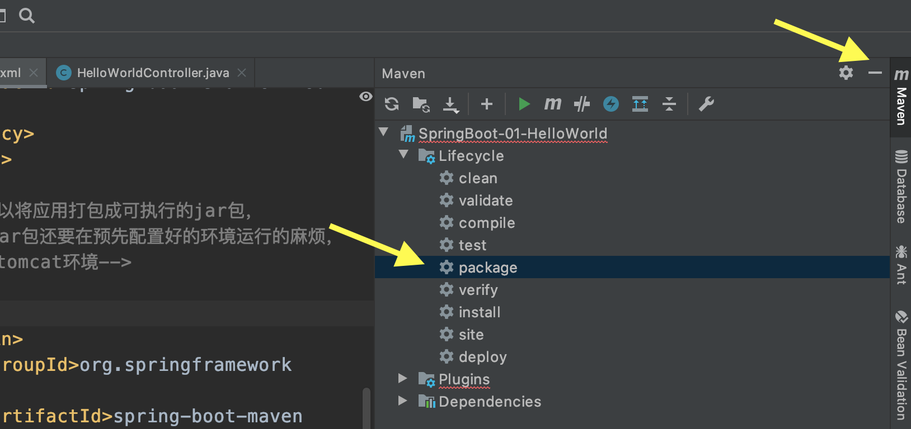
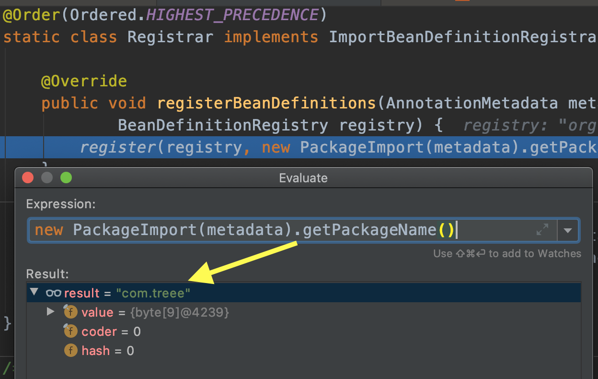
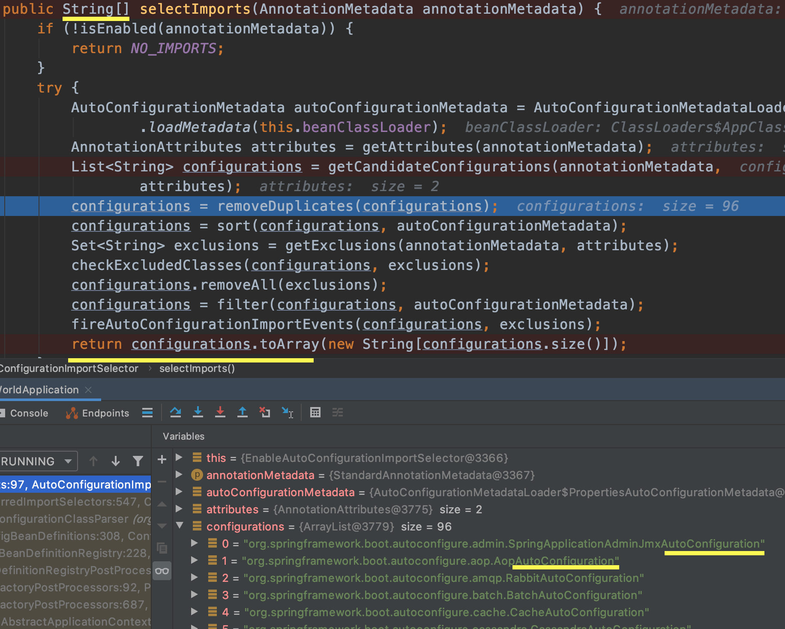
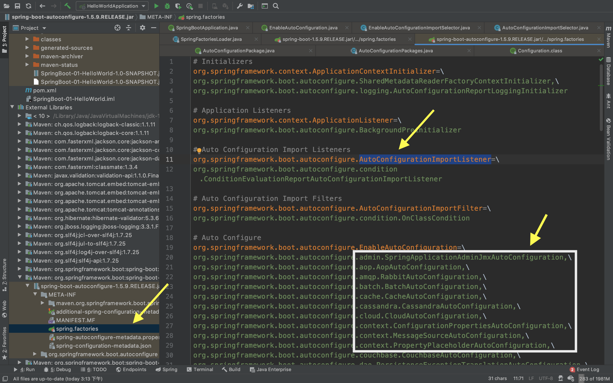

# 【01】SpringBoot入门

# 一、SpringBoot

## 1. 简介

springboot简化了配置，只需要少量配置就能创建一个独立的产品级别的应用。

- 快速创建独立运行的Spring项目以及继承主流框架
- 使用了嵌入的servlet容器，应用无需打包成war包，只需要jar命令即可运行
- starters自动依赖和版本控制：如果我们需要web相关包，我们就可以直接通过staters导入，同理jdbc、redis相关都可以通过starters管理
- 自动配置简化开发，也可以修改默认值：减少开发者的使用成本
- 无需配置xml
- 与云计算天然集成：SpringCloud，微服务

## 2. 微服务

将业务架构拆分多个微服务，每个服务是一个独立的进程，互相之间通过HTTP形式互通；

每个服务之间够可以独立维护升级；

对于spring全家桶来说：

- springboot帮助我们构建独立的服务；
- springcloud将服务连接组织起来并互相连接

# 二. SpringBoot HelloWorld

## 1. 首先启动SpringBoot应用

```java
@SpringBootApplication // 标注这里是主程序类，告诉SpringBoot这里是个SpringBoot应用
public class HelloWorldApplication {
    public static void main(String[] args) {
        // 启动Springboot
        SpringApplication.run(HelloWorldApplication.class, args);
    }
}
```

> TODO：这里可以延伸SpringBoot的启动流程与注解

## 2. 编写相关Controller、Service

```java
@Controller // 1. 首先它要能处理请求，所以添加该注解
public class HelloWorldController {
    @RequestMapping("/hello") // 2. 意思是接受浏览器的hello请求
    @ResponseBody // 3. 该注解告诉浏览器这个方法的返回值就是浏览器需要的返回值
    // 4. 以上都是属于SpringMVC的功能
    public String hello() {
        String helloResult = "Hello World";
        return helloResult;
    }
}
```


## 3. 测试

运行`main`方法，打开[http://localhost:8080/](http://localhost:8080/)

这时候第一次打开会发现返回的是一个`Whitelabel Error Page`页面，现在先不用管。

直接让浏览器发送一个hello请求，也就是[http://localhost:8080/hello](http://localhost:8080/hello)

可以看到浏览器中显示了`Hello Wolrd`，也就是上面Controller中返回的ResponseBody。

综上，使用SpringBoot我们就可以不需要再配置包扫描之类的SpringMVC相关配置，简化开发流程。


## 4. 简化部署

不需要打包成war包，也不用提前准备好tomcat环境，SpingBoot可以直接打包成可执行的jar包。

而这个主要是maven的插件提供的能力：首先在pom.xml下添加依赖；

```xml
<!--这个插件，可以将应用打包成可执行的jar包，
    避免了以前打包成war包还要在预先配置好的环境运行的麻烦，无需在目标服务器安装tomcat环境-->
    <build>
        <plugins>
            <plugin>
                <groupId>org.springframework.boot</groupId>
                <artifactId>spring-boot-maven-plugin</artifactId>
            </plugin>
        </plugins>
    </build>
```

然后在IDEA的maven界面将其打包（也就是mvn package）



打包完成后会放在`IdeaProjects/SpringBoot-01-HelloWorld/target/SpringBoot-01-HelloWorld-1.0-SNAPSHOT.jar`下，往上翻一翻就能看到。

而得到这个jar包，我们就可以独立的使用jar命令就可以让它运行：

`java -jar target/SpringBoot-01-HelloWorld-1.0-SNAPSHOT.jar `

此时我们再访问[http://localhost:8080/hello](http://localhost:8080/hello)，也依然有效，能看到helloworld，而这次的运行就和IDEA无关了，也不需要自己配置Tomcat环境。

# 三、HelloWorld探究

那么以上这一切是如何发生的？

## 1. POM文件

### (1) 版本依赖

SpringBoot，通过pom文件管理环境版本依赖：

```xml
<parent>
        <groupId>org.springframework.boot</groupId>
        <artifactId>spring-boot-starter-parent</artifactId>
        <version>1.5.9.RELEASE</version>
    </parent>
```

而点进`spring-boot-starter-parent`这个父项目。

```xml
<parent>
		<groupId>org.springframework.boot</groupId>
		<artifactId>spring-boot-dependencies</artifactId>
		<version>1.5.9.RELEASE</version>
		<relativePath>../../spring-boot-dependencies</relativePath>
	</parent>
```

在这个dependency里面，也就是`spring-boot-dependencies-1.5.9.RELEASE.pom`，我们可以看到各种各样环境的版本号，比如jdbc、elasticsearch等等；

所以这也可以称为SpringBoot的版本仲裁中心，以后我们导入依赖时默认时不需要写版本的。

### (2) 导入依赖

```xml
 <dependencies>
        <dependency>
            <groupId>org.springframework.boot</groupId>
            <artifactId>spring-boot-starter-web</artifactId>
        </dependency>
    </dependencies>
```

这里导入了一个**启动器**依赖

- spring-boot-starter-web：springboot场景启动器，帮助我们导入web模块正常运行所依赖的组建。点进去可以看到其中添加了Tomcat、Jackson、SpringMVC相关的依赖。

而这个只是一个web应用的启动器，SpringBoot还提供了各种功能场景的相应Starter，只需要使用相关场景的启动器，他就会自动导入需要的依赖，比如消息队列场景、邮件开发场景。

## 2. 主入口类

入口类中，最重要的就是上面的注解。 

```java
@SpringBootApplication // 标注这里是主程序类，告诉SpringBoot这里是个SpringBoot应用
public class HelloWorldApplication {
    public static void main(String[] args) {
        // 启动Springboot
        SpringApplication.run(HelloWorldApplication.class, args);
    }
}
```

`@SpringBootApplication`：这个注解，说明这个类时SpringBoot的主配置类，SpringBoot就运行这个类的main方法来启动SpringBoot应用。

而这个注解的实现中，也有几个重要的注解：

```java
@Target(ElementType.TYPE)
@Retention(RetentionPolicy.RUNTIME)
@Documented
@Inherited
@SpringBootConfiguration  // 1 <---------
@EnableAutoConfiguration  // 2 <---------
@ComponentScan(excludeFilters = {
		@Filter(type = FilterType.CUSTOM, classes = TypeExcludeFilter.class),
		@Filter(type = FilterType.CUSTOM, classes = AutoConfigurationExcludeFilter.class) })
public @interface SpringBootApplication {
```

### (1) @SpringBootConfiguration

1. **@SpringBootConfiguration**`: SpringBoot的配置类，标注在某一个类上，表示这是一个SpringBoot的配置类。`

   1. `而这个注解也是由`@Configuration`实现的。这是Spring的老朋友了，通过这个注解来标注配置类，可以替代繁琐的配置文件（配置类 == 配置文件）；而点进去看配置类也是容器中的一个组件`@Component`。

### (2) @EnableAutoConfiguration

2. **@EnableAutoConfiguration**： 开启自动配置功能

   1. 以前我们需要配置的东西，SpringBoot通过这个注解帮我们自动配置功能；

   2. 这也是个组合注解：

      ```java
      ...
      @AutoConfigurationPackage
      @Import(EnableAutoConfigurationImportSelector.class)
      public @interface EnableAutoConfiguration {
      ```

      1. **@AutoConfigurationPackage**： 自动配置包；这也是个组合注解，其中使用了一个Spring的底层注解：@Import(AutoConfigurationPackages.Registrar.class)：其作用就是给容器中导入一个组件，也就是后面那个class。

         1. 那导入了什么组件呢？我们看看这个class

            

            通过打断点evaluate可以看到：

            **这个方法就是把主入口类主配置类所在的包下面的所有组件拿到，然后通过扫描导入到Spring容器**

      2. **@Import(EnableAutoConfigurationImportSelector.class)**：

         1. 给容器中导入组件：EnableAutoConfigurationImportSelector.class
            而这个类，可以看作是导入哪些组件的选择器。细看他的实现，可以直接看他的父类：AutoConfigurationImportSelector

            ```java
            public String[] selectImports(AnnotationMetadata annotationMetadata) {
            ```

            将所有需要导入的组件以全类名的字符串数组形式返回，这些组件就会被添加到怕Spring容器中。

            通过断点我们可以看到：

            
            可以发现这个方法会给容器导入很多自动配置类（xxxAutoConfiguration）:其中自动配置类的功能就是给相应场景导入需要的类，比如AOP就导入aop相关的自动配置类，mongodb就导入相应自动配置类等。

            有了自动配置类，免去了手动编写配置注入功能组件的工作

            ```java
            List<String> configurations = SpringFactoriesLoader.loadFactoryNames(
                  getSpringFactoriesLoaderFactoryClass(), // EnableAutoConfiguration.class;
              getBeanClassLoader());
            ```

            这个`loadFactoryNames()`，是从META-INF/spring.factories路径下获取`EnableAutoConfiguration.class;`所指定的值。Springboot会将这些值作为自动配置类导入容器中。

            

            比如J2EE的整体整合解决方案和自动配置，都在`org.springframework.boot.autoconfigure`中做好了配置。

            所以SpringBoot能够简化配置的原因就在这里，以前的自己手动配置都被这个自动配置类做了。 

         **注意：**
         **先执行的是@Import(AutoConfigurationImportSelector.class)读取到近百个自动配置包，**

         **然后执行的是@Import(AutoConfigurationPackages.Registrar.class)获取当前入口类的包名**

# 四、Spring Initializer快速创建项目

了解了上文的pom配置各个starter之后，我们就可以通过idea的项目创建向导，选择我们需要的模块进行项目的初始化，就会联网获取到各个场景的依赖以及相应版本，更节省了我们在网上找maven依赖的时间。

其中，IDEA默认生成的SpringBoot项目中

- 主程序已经生成好了，只需要自己的业务逻辑
- 出现了一个Resource文件，其目录结构如下
  - static：保存所有的静态资源：js css images
  - templates：保存所有的模版页面；可以使用模版引擎（freemarker、thymeleaf）；SpringBoot默认Jar包使用嵌入的tomcat，默认不支持jsp页面；
  - application.properties：应用配置文件，比如端口号8080就可以在这里修改。

