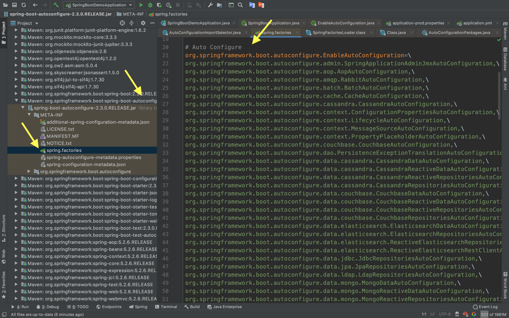
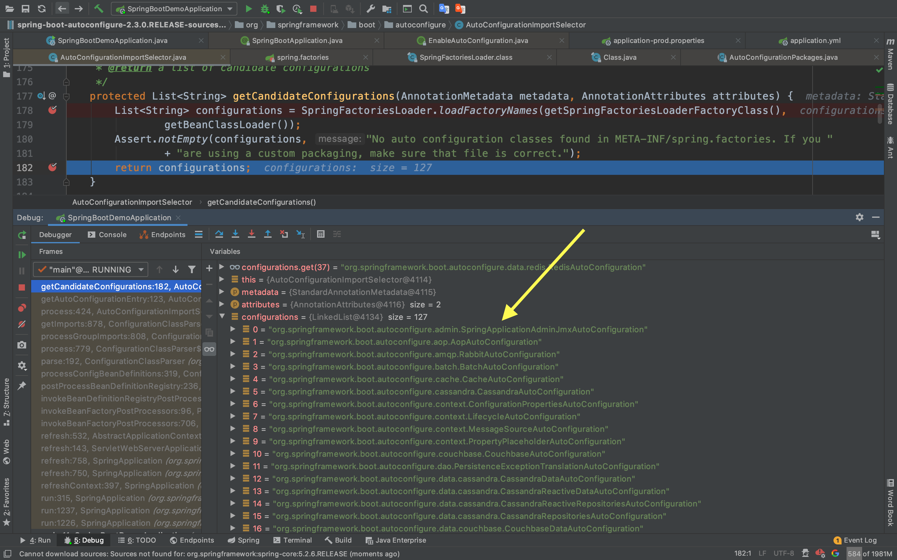
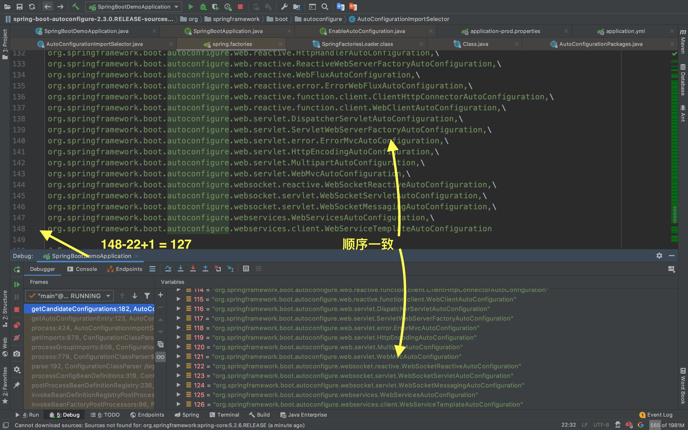

# 【02】SpringBoot配置文件

# 一、配置文件与相关注解

## 1. 配置文件

SpringBoot使用一个全局的配置文件，且名字是固定的：

- application.properties
- application.yml

配置文件的作用：修改Springboot自动配置的默认值；

除此之外，配置文件也可以描述类以及他的值：

### (1) @ConfigurationProperties获取值

比如我要声明一个Person类，可以通过读取yml配置文件中的配置，将所配置的值注入到声明的类中，以下展示一下过程：

```java
@Component // 2. 告诉Spring容器，我这里需要作为一个组件装载进容器中
@ConfigurationProperties(prefix = "person") 
// 1. 告诉这个类可以通过读取配置文件的方式获得属性，读取配置文件中的person
public class Person {
    private String name;
    private String id;
    // 要有getter、setter，否则之后的单元测试输出的是null
```

然后在yml配置文件中手动配置好：

```yaml
person:
  name: 张三
  id: 11
```

在单元测试的代码中测试：

```java
@SpringBootTest
class SpringBootDemoApplicationTests {
	@Autowired // 注入配置中的属性
	Person person;
	@Test
	void contextLoads() {
		System.out.println(person);
	}
}
// 得到：
// Person{name='张三', id='11'} 成功！
```

除了读取yml配置之外，application.properties也可以通过另一种注解来读取；

### (2) @Value 获取值

```txt
person.name=Alice
person.id=10
```

首先在application.properties中添加我们想要增加的属性值，其中的值都可以通过`@Value`依赖注入到想要的类中，比如以下面结合了此方法与上一种方法的Controller为例

```java
@RestController
// 这是ResponseBody和Controller的组合注解，
// 使用这个就可以不用在sayHello那里再加ResponseBody了
public class HelloController {

    @Value("${person.name}")
    private String name;

    private final Person person;
  
    // 注意：如果想要读取另一个配置文件，
    // 使其输出张三，就要在yml以及相应Controller注解上制定另一个配置文件中的person，
    // 比如这里我改成了person2，使其输出张三而不是person的Alice
    public HelloController(Person person) {
        this.person = person;
    }

    @RequestMapping("hello")
    public String sayHello() {
        return "Hello " + name + "; Hi " + person.getName();
      	// Hello Alice; Hi 张三
    }
}
```

## 2. 自定义配置文件

```java
@PropertySource(value = {"classpath:person.properties"})
public class Person {
  ...
```

在JavaBean之前加上该`@PropertySource`注解，就可以指定某个配置文件中的配置作为注入的值。

除此之外，可以在主入口类的上面使用`@ImportResource(value = {"classpath:xxx.properties"})`，向Spring容器加载相关组件。


SpringBoot推荐给容器中添加组件的方式：使用全注解的方式。

使用`@Bean`给容器中添加组件：当我们需要给应用增加一个Service时，需要声明好一个config作为配置

```java
/**
 * @Configuration: 指明当前类是个配置类。也就是代替Spring之前的xml配置
 */
@Configuration
public class HelloConfig {

    // 将方法的返回值添加到容器中
    @Bean // 就是类似Spring用xml标签<bean></bean>的形式添加组件
    public HelloService helloService02() {
        System.out.println("DONE");
        return new HelloService();
    }
}

```

以上这个方法，就相当于是在xml文件中，将一个HelloService以helloService02的id返回了。可以在下面的测试中看到：

```java
@SpringBootTest
class HelloServiceTest {
    @Autowired
    ApplicationContext ioc;
    @Test
    void testHelloService() {
        boolean hasService = ioc.containsBean("helloService02");
        // 注意containsBean名字是要和创建配置bean的方法名一致
        System.out.println(hasService);
        // true， 如果字符串里的和Config的方法名不一致，就是false了
    }

}
```


## 3. 配置文件占位符

并且，在properties文件中，还可以使用一些方法：比如随机数`${random.value}`、等等方法。并且还可以引用之前的变量。

## 4. 多Profile文件


在主配置文件编写时，文件名可以是`application-{XXX}.properties/yml`。

比如生产环境下命名为`application-prod.properties/yml`，开发环境是`application-dev.properties/yml`。

再根据需求激活不同的环境配置。

**(1) properties**

不过默认还是会使用`application.properties`的，所以需要在这个里面指定好需要激活的配置文件：

`spring.profiles.active=dev`

**(2) yml**

yml可以使用其特性：文档块进行区分不同的配置，而不再需要新建多个文件。

```yaml
server:
  port: 8080
spring:
  profiles:
    active: dev
---
server:
  port: 8081
spring:
  profiles: dev
---
server:
  port: 8082
spring:
  profiles: prod
```

**(3) 命令行**

以IDEA下开发为例，就是在Run/Debug Configuration下的Program arguments添加如下参数（较新的版本会是Override Parameter）

`--spring.profiles.active=dev`

除了上面开发环境下的配置之外，在部署时，我们会通过java -jar 命令来运行打包好的SpringBoot应用，这时候就可以在后面跟上上面的参数，让应用部署时启用需要的配置。

# 二、自动配置原理

自动配置流程【以SpringBoot 2.3.0 源码为例】：

## 1. @EnableAutoConfiguration 源码阅读

1. SpringBoot启动的时候，加载了主配置类，开启了自动配置功能`@EnableAutoConfiguration`
2. `@EnableAutoConfiguration`的作用（可以参考第一章的源码浅析）：
   - 利用`AutoConfigurationImportSelector`这个selector给容器中导入一些组件。
   - 组件是通过`AutoConfigurationImportSelector#selectImports`这个方法获取候选的配置。
     - 该方法中的`getAutoConfigurationEntry`会获取到`List<String> configurations`，这就是我们想要的候选配置（比如AopAutoConfiguration、RedisAutoConfiguration百来个自动配置类）
     - 那么他是怎么得到的呢？`SpringFactoriesLoader.loadFactoryNames`
       通过这个方法扫描所有jar包类路径下 `META-INF/spring.factories`
       - 可以看图
         
         
         
     - 其作用:
       把扫描到的这些文件的内容包装成一个properties对象

## 2. TO BE CONTINUE 


