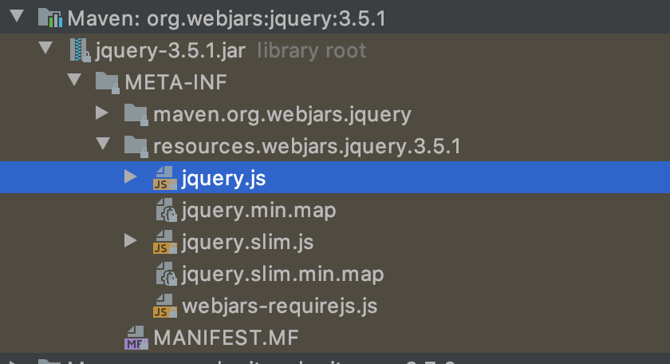
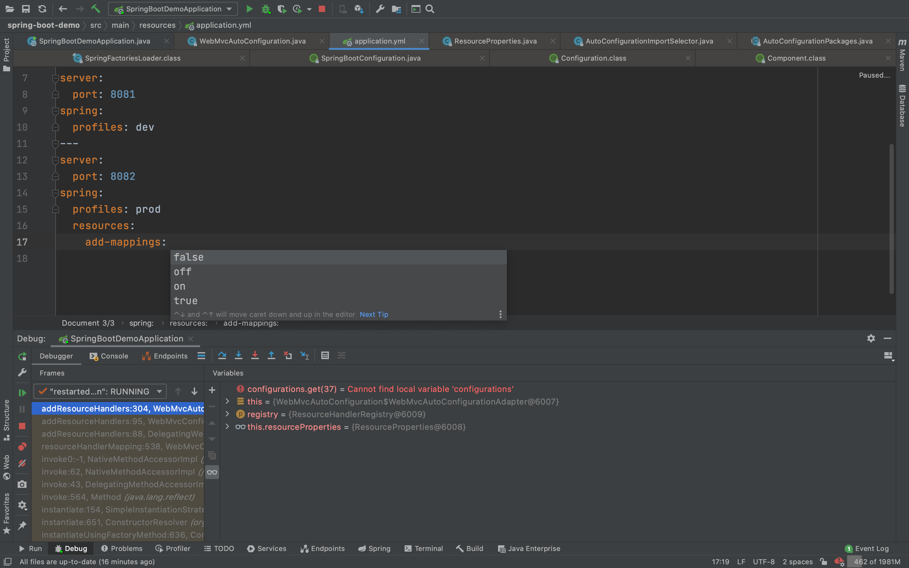
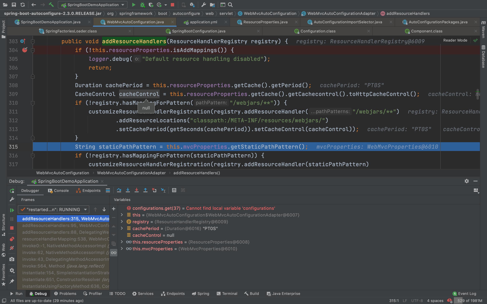
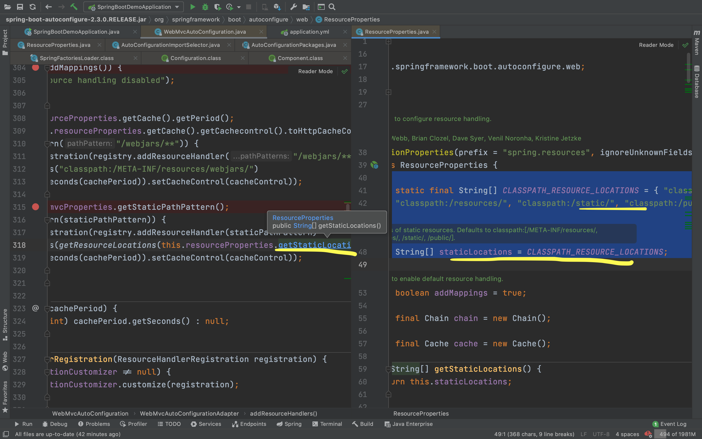

**使用SpringBoot进行业务开发**

1. 创建SpirngBoot应用，选中我们需要的模块
2. SpringBooit已经默认将这些场景配置好了，只需要在配置文件中指定少量的配置就可以运行起来。
3. 编写自己的业务代码

**关键：自动配置原理**

这个场景springboot为我们配置了什么？能不能修改？能修改哪些配置？能不能扩展？……

- xxxAutoConfiguration: 帮我们给容器中自动配置组件；
- xxxProperties：配置类来封装配置文件的内容；

# 二. SpringBoot对静态资源的映射规则

```java
// org.springframework.boot.autoconfigure.web.servlet.WebMvcAutoConfiguration.WebMvcAutoConfigurationAdapter#addResourceHandlers
@Override
public void addResourceHandlers(ResourceHandlerRegistry registry) {
   //......
   if (!registry.hasMappingForPattern("/webjars/**")) {
      customizeResourceHandlerRegistration(registry.addResourceHandler("/webjars/**")
            .addResourceLocations("classpath:/META-INF/resources/webjars/")
            .setCachePeriod(getSeconds(cachePeriod)).setCacheControl(cacheControl));
   }
   //.......
   }
}
```

这里是如何将静态资源映入的呢？

通过WebMvcAutoConfiguration这个自动配置类的源码我们就可以清楚看到：

1. 所有的`/webjars/**`，都去`classpath:/META-INF/resources/webjars/`找资源；

   1. webjars是什么？以jar包的形式引入静态资源。

   2. https://www.webjars.org/：参考其中的maven依赖，其作用就是帮助我们更方便的使用bootstrap、jquery等webjars。

   3. 所以引入maven之后，

      

      [http://localhost:8080/webjars/jquery/3.5.1/jquery.js](http://localhost:8080/webjars/jquery/3.5.1/jquery.js)，我们就可以直接访问到相应的文件。


## 2.1 源码阅读

> org.springframework.boot.autoconfigure.web.servlet.WebMvcAutoConfiguration.WebMvcAutoConfigurationAdapter#addResourceHandlers


是否加载静态资源可由一个开关控制，也就是下面这个截图中的add-mapping，也就是上图代码中的高亮 `isAddMappings`，这个字段对应了下方的配置。

如果配置了false，那么所有的静态资源都不会被重写，都是0，比如



那么相关资源是如何引入的呢？



通过`/webjars/**`可以访问相应的依赖下的资源，比如jquery的js资源。并且可以在这个代码中可以看到，相应的静态资源还可以缓存一段时间，时间是可以配置的。

同时，还有一段

```java
			String staticPathPattern = this.mvcProperties.getStaticPathPattern();
```

该静态地址是有默认值的




# 三. 模版引擎

Springboot + Thymeeaf

首先引入：

```xml
<dependency>
	<groupId>org.springframework.boot</groupId>
	<artifactId>spring-boot-starter-thymeleaf</artifactId>
</dependency>
```

## 1. Thymeleaf使用与语法

我们都已经知道了，SpringBoot的自动配置原理就是通过各个场景下的自动配置类来做的，那么他们的可配置项以及其配置生效的流程肯定都在代码里：

1. `spring-boot-autoconfigure-2.3.0.RELEASE.jar!/META-INF/spring.factories`通过自动配置文件的spring.factorieaf找到其中的`ThymeleafAutoConfiguration`。

2. 关键配置类：private final ThymeleafProperties properties;

3. 其源码：

   ```Java
   @ConfigurationProperties(prefix = "spring.thymeleaf")
   public class ThymeleafProperties {
      private static final Charset DEFAULT_ENCODING = StandardCharsets.UTF_8;
      public static final String DEFAULT_PREFIX = "classpath:/templates/";
      public static final String DEFAULT_SUFFIX = ".html";
     // 只要我们把html页面放在classpath:/templates/下，那么thymeleaf就会帮我们自动渲染
   ```

   只要我们把html页面放在classpath:/templates/下，那么thymeleaf就会帮我们自动渲染


