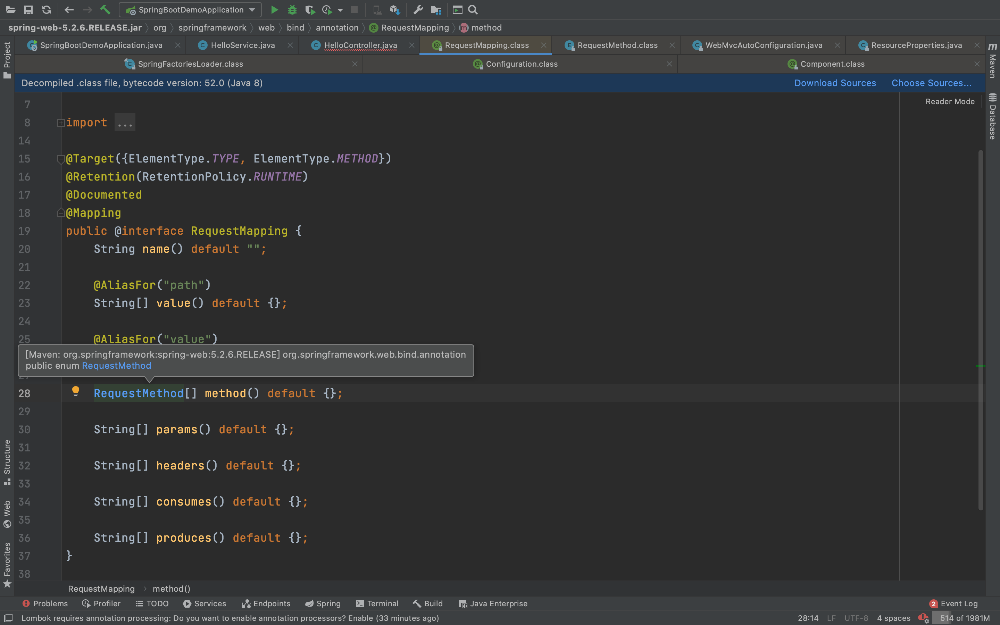
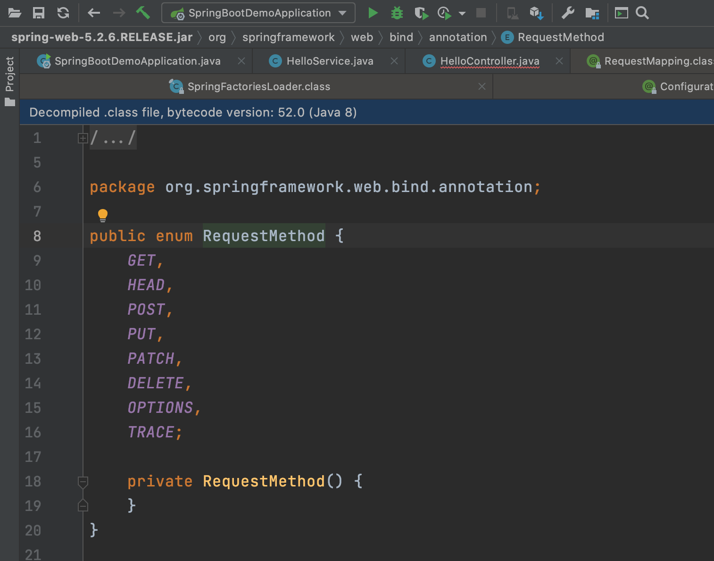

# SpringBoot 请求参数处理


在最简单的demo中，springboot通过url的形式传入参数，发起请求：

```java
		@RequestMapping("hello")
    public String sayHello() {
        return "Hello " + name + "; Hi " + person.getName();
    }
```

这个过程`@RequestMapping("hello")`的过程称为请求映射。

## 一. REST 风格支持

## 1.1 什么是REST风格

- Rest风格支持（*使用**HTTP**请求方式动词来表示对资源的操作*）

- - *以前：**/getUser*  *获取用户*   */deleteUser* *删除用户*   */editUser*  *修改用户*    */saveUser* *保存用户*
  - *现在： /user*   *GET-**获取用户*   *DELETE-**删除用户*   *PUT-**修改用户*    *POST-**保存用户 * 【这里就是通过HTTP的请求方式减少请求个数，具体可以看下面源码截图】
  - 核心Filter；HiddenHttpMethodFilter

- - - 用法： 表单method=post，隐藏域 _method=put
    - SpringBoot中手动开启

- - 扩展：如何把_method 这个名字换成我们自己喜欢的。



使用**HTTP**请求方式动词来表示对资源的操作



对应的业务代码调用如下：

```java
@RequestMapping(value = "user", method = RequestMethod.GET)
    public String getUser() {
        return "zhangsan";
    }

    @RequestMapping(value = "user", method = RequestMethod.DELETE)
    public String deleteUser() {
        return "delete-zhangsan";
    }
```

但是在通过url使用的时候，url并不直接展示http的操作，所以需要在html中增加表单的method描述

```html
@see src/main/resources/templates/index.html
。省略。。
<h1>treee</h1>
测试rest风格
<form action="/user" method="get">
    <input value="rest-get" type="submit">
</form>
<form action="/user" method="delete">  // 但是，单纯的这样描述并不能实现delete的表单发送，会直接返回get的返回值
    <input value="rest-delete" type="submit">
</form>
。。。。

```

## 1.2 如何开启REST风格

但是，单纯的这样描述并不能实现delete的表单发送，会直接返回get的返回值。所以怎么让springboot支持**HTTP**请求方式动词中的delete、put等请求方式呢？

> 回归源码：org.springframework.boot.autoconfigure.web.servlet.WebMvcAutoConfiguration

```java
@Bean
	@ConditionalOnMissingBean(HiddenHttpMethodFilter.class)
	@ConditionalOnProperty(prefix = "spring.mvc.hiddenmethod.filter", name = "enabled", matchIfMissing = false)
	public OrderedHiddenHttpMethodFilter hiddenHttpMethodFilter() { // <<<<<-------
		return new OrderedHiddenHttpMethodFilter();
	}
```


进入 > org.springframework.web.filter.HiddenHttpMethodFilter#doFilterInternal

可以看到，虽然springboot支持rest形式的请求，但是mvc只接受post形式的http请求，然后在post的基础上，读取相应的methodParam参数


那么methodParam是什么呢？只需要看一下他的声明与配置即可。

```java
public class HiddenHttpMethodFilter extends OncePerRequestFilter {
    private static final List<String> ALLOWED_METHODS;
    public static final String DEFAULT_METHOD_PARAM = "_method";
    private String methodParam = "_method"; // <<<<<<<-----------
//......
```

所以我们可以在`index.html`中配置`hidden`的`_method`字段配置

```html
<form action="/user" method="post">
    <input name="_method" type="hidden" value="DELETE"/> // <<<<<-------
    <input value="rest-delete" type="submit"/>
</form>
```

但是单纯这样还不够，因为目前springboot还不支持post的filter，因为以下这段代码配置

> org.springframework.boot.web.servlet.filter.OrderedHiddenHttpMethodFilter

```java
	@ConditionalOnProperty(prefix = "spring.mvc.hiddenmethod.filter", name = "enabled", matchIfMissing = false)
```

可以看到默认的开关时false，也就是不会生效，所以我们需要在yaml中配置相关的prefix的值

在IDEA中键入hiddenmethod就会自动补全相关的prefix了：

```yaml
mvc:
    hiddenmethod:
      filter:
        enabled: true
```

## 二、'POST' not supported 问题

### 2.1 问题描述 

在以上配置做完了之后，在网页上发起post请求


发现返回了错误，如下：

```
Whitelabel Error Page
This application has no explicit mapping for /error, so you are seeing this as a fallback.

Fri Feb 26 13:14:48 CST 2021
There was an unexpected error (type=Method Not Allowed, status=405).
Request method 'POST' not supported
org.springframework.web.HttpRequestMethodNotSupportedException: Request method 'POST' not supported
	at org.springframework.web.servlet.mvc.method.RequestMappingInfoHandlerMapping.handleNoMatch(RequestMappingInfoHandlerMapping.java:213)
	.....
	.....
```

### 2.2 问题解决

```java
@RequestMapping(value = "user", method = RequestMethod.POST) // <<<------ 需要将这个原本的DELETE改为与html对应的POST
public String deleteUser() {
    return "delete-zhangsan";
}
```


## 三、REST表单提交 源码详解

所以所谓的REST风格，对于SpringBoot来说，就是在容器中加了一个filter，通过post+method的形式用以相应rest风格中的各个操作。

通过debug的方式进行源码阅读：


