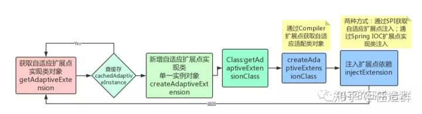

dubbo-SPI自适应拓展源码探究

> 参考链接：
> [Dubbo 中的 URL 统一模型](http://dubbo.apache.org/zh-cn/blog/introduction-to-dubbo-url.html)
> [dubbo源码解读之扩展点加载机制](https://zhuanlan.zhihu.com/p/85458677)
> [官网：SPI扩展点加载](https://dubbo.apache.org/zh-cn/docs/dev/SPI.html)
> [官网：自适应扩展机制](https://dubbo.apache.org/zh-cn/docs/source_code_guide/adaptive-extension.html)
> [从源码的单元测试理解Adaptive](https://blog.51cto.com/dba10g/1880962)

# 一、SPI的缺点与dubbo的解决
> 本节参考链接：[【Dubbo系列】扩展点自适应与IOC增强](https://zhuanlan.zhihu.com/p/52900699)
> 之前我们通过Java SPI的例子，探究了一下简单dubbo的SPI机制，但是还有一些不完善的地方，比如在使用扩展点时，如何动态的确定使用的是哪个扩展点实现。

比如一个扩展点`SimpleExt`：
> com.alibaba.dubbo.common.extensionloader.ext1.SimpleExt

```java
@SPI("impl1")
public interface SimpleExt {
    // @Adaptive example, do not specify a explicit key.
    @Adaptive
    String echo(URL url, String s);

    @Adaptive({"key1", "key2"})
    String yell(URL url, String s);

    // no @Adaptive
    String bang(URL url, int i);
}
```

他有3个实现扩展点实现：`SimpleExtImpl1`、`SimpleExtImpl2`、`SimpleExtImpl3`，
```
// META-INF/dubbo/internal/com.alibaba.dubbo.common.extensionloader.ext1.SimpleExt
// 也就是这个描述文件所提供的三个接口实现
# Comment 1
impl1=com.alibaba.dubbo.common.extensionloader.ext1.impl.SimpleExtImpl1#Hello World
impl2=com.alibaba.dubbo.common.extensionloader.ext1.impl.SimpleExtImpl2  # Comment 2
   impl3=com.alibaba.dubbo.common.extensionloader.ext1.impl.SimpleExtImpl3 # with head space
```
那么在调用方法时，如何动态确定使用的是哪个扩展点呢？

Dubbo提出了一种思路，可以通过在运行期动态生成一个 自适应扩展点实现类 来要解决上面的问题：

## 1. @Adaptive 描述需要拓展的方法

1. 首先需要**确定扩展点中哪些方法需要调用不同的扩展点**实现，可以通过`@Adaptive`注解来标注需要生成自适应扩展点实现的类和方法。

```java
@Documented
@Retention(RetentionPolicy.RUNTIME)
@Target({ElementType.TYPE, ElementType.METHOD})
public @interface Adaptive {
```

标注在扩展点实现类上时，表示该类为自适应扩展点实现类；
标注在扩展点方法上时，比如例子中的`echo`和`yell`方法，那么表示这两个方法需要根据 **参数URL** 调用对应的扩展点实现。

这一点可以参考`com.alibaba.dubbo.common.extensionloader.ExtensionLoader_Adaptive_Test#test_getAdaptiveExtension_customizeAdaptiveKey`

```java
@Test
    public void test_getAdaptiveExtension_customizeAdaptiveKey() throws Exception {
        SimpleExt ext = ExtensionLoader.getExtensionLoader(SimpleExt.class).getAdaptiveExtension();

        Map<String, String> map = new HashMap<String, String>();
        map.put("key2", "impl2");
        URL url = new URL("p1", "1.2.3.4", 1010, "path1", map);

        String echo = ext.yell(url, "haha");
        assertEquals("Ext1Impl2-yell", echo);

        url = url.addParameter("key1", "impl3"); // note: URL is value's type
        echo = ext.yell(url, "haha");
        assertEquals("Ext1Impl3-yell", echo);
    }
```

可以看到，通过设置URL，并且在URL之后添加`<K,V>`形式的值，来指定我们想要调用的方法实现。
## 2. 参数URL 
>  参数URL 包括协议、权限信息、参数等一系列信息。

URL的形式很自由，除了SPI指定之外，还能承载转化成URL参数的Bean属性。

并且，根据URL的协议头，可以对dubbo的服务暴露与引用也有至关重要的作用。
详见：[Dubbo 中的 URL 统一模型](http://dubbo.apache.org/zh-cn/blog/introduction-to-dubbo-url.html)

> 此处引用呈现一部分基于注册中心的服务暴露于服务引用：
> **向注册中心暴露服务：**
> 在有注册中心，需要注册提供者地址的情况下，`ServiceConfig` 解析出的 URL 的格式为: `registry://registry-host/org.apache.dubbo.registry.RegistryService?export=URL.encode("dubbo://service-host/com.foo.FooService?version=1.0.0")`，
>
> 基于扩展点自适应机制，通过 `URL` 的 `registry://` 协议头识别，就会调用 `RegistryProtocol` 的 `export()` 方法，将 `export` 参数中的提供者 `URL`，先注册到注册中心。
>
> 再重新传给 `Protocol` 扩展点进行暴露： `dubbo://service-host/com.foo.FooService?version=1.0.0`，然后基于扩展点自适应机制，通过提供者 URL 的 `dubbo://` 协议头识别，就会调用` DubboProtocol` 的 `export()` 方法，打开服务端口。
> **从注册中心发现引用服务：**
> 在有注册中心，通过注册中心发现提供者地址的情况下，ReferenceConfig 解析出的 URL 的格式为：`registry://registry-host/org.apache.dubbo.registry.RegistryService?refer=URL.encode("consumer://consumer-host/com.foo.FooService?version=1.0.0")`。
>
> 基于扩展点自适应机制，通过 URL 的 `registry://` 协议头识别，就会调用 `RegistryProtocol` 的 `refer()` 方法，基于 refer 参数中的条件，查询提供者 URL，如： `dubbo://service-host/com.foo.FooService?version=1.0.0`。
>
> 基于扩展点自适应机制，通过提供者 URL 的 `dubbo://` 协议头识别，就会调用 `DubboProtocol` 的 `refer()` 方法，得到提供者引用。
>
> 然后 `RegistryProtocol` 将多个提供者引用，通过 `Cluster` 扩展点，伪装成单个提供者引用返回。


## 3. 根据注解和URL，生成自适应扩展点实现类
上文我们提到
> Dubbo提出了一种思路，可以通过在**运行期动态生成**一个 *自适应扩展点实现类* 来要解决上面的问题

那什么是运行期动态生成呢？
简单来说就是以下内容的其中一点：
> 首先生成自适应拓展类的源码，然后通过 Compiler 实例（Dubbo 默认使用 javassist 作为编译器）编译源码，得到代理类 Class 实例。


https://zhuanlan.zhihu.com/p/52900699

下面具体讲讲整个流程的细节，以下内容在很多文章中都会出现，尽量避开繁多的源码呈现，更多的介绍整体思路。
> 本节参考链接：
> [官网：SPI自适应拓展](https://dubbo.apache.org/zh-cn/docs/source_code_guide/adaptive-extension.html)
> [dubbo源码解读之扩展点加载机制](https://zhuanlan.zhihu.com/p/85458677)
> [【Dubbo系列】扩展点自适应与IOC增强](https://zhuanlan.zhihu.com/p/52900699)

# 二、自适应拓展源码探究


### 0. 源码探究


### 1. 获取自适应拓展实现类对象
getAdaptiveExtension 方法是获取自适应拓展的入口方法
```java
    public T getAdaptiveExtension() {
         // 从缓存中获取自适应拓展
        Object instance = cachedAdaptiveInstance.get();
        if (instance == null) { // 缓存未命中
            if (createAdaptiveInstanceError == null) {
                // 创建异常缓存，避免失败后重复创建，浪费系统资源
                synchronized (cachedAdaptiveInstance) {
                    instance = cachedAdaptiveInstance.get();
                    if (instance == null) {
                        try {
                            // 实例对象为空，则新增createAdaptiveExtension()
                            instance = createAdaptiveExtension();// <--2.反射实例化并注入依赖---------
                            // 设置自适应拓展到缓存中
                            cachedAdaptiveInstance.set(instance);
                        } catch (Throwable t) {
                            // 捕获异常，将异常添加到缓存；再抛出,防止吞掉异常
                            createAdaptiveInstanceError = t;
                            throw new IllegalStateException("fail to create adaptive instance: " + t.toString(), t);
                        }
                    }
                }
            } else {
                throw new IllegalStateException("fail to create adaptive instance: " + createAdaptiveInstanceError.toString(), createAdaptiveInstanceError);
            }
        }

        return (T) instance;
    }
```

通过`ExtensionLoader.getAdaptiveExtension`方法获得扩展点的自适应实现类。

`getAdaptiveExtension` 方法首先会检查缓存，缓存未命中，则调用 `createAdaptiveExtension` 方法创建自适应拓展

使用`cachedAdaptiveInstance` 缓存实例对象。因为我们使用静态工厂来创建单一实例对象`ExtensionLoader`，所以需要使用`volatile`修饰实例对象以保证线程安全性。

### 2. 反射实例化并注入依赖

```java
private T createAdaptiveExtension() {
    try {
        // 获取自适应拓展类，并通过反射实例化
        return injectExtension((T) getAdaptiveExtensionClass().newInstance());
    } catch (Exception e) {
        throw new IllegalStateException("Can not create adaptive extension " + type + ", cause: " + e.getMessage(), e);
    }
}
```

`createAdaptiveExtension` 方法的代码比较少，但却包含了三个逻辑，分别如下：

- 调用 `getAdaptiveExtensionClass` 方法获取自适应拓展 Class 对象
- 通过反射进行实例化
- 调用 `injectExtension` 方法向拓展实例中注入依赖

前两个逻辑比较好理解，第三个逻辑用于向自适应拓展对象中注入依赖。这个逻辑看似多余，但有存在的必要，这里简单说明一下。前面说过，Dubbo 中有两种类型的自适应拓展，一种是手工编码的，一种是自动生成的。手工编码的自适应拓展中可能存在着一些依赖，而自动生成的` Adaptive` 拓展则不会依赖其他类。这里调用 `injectExtension` 方法的目的是为手工编码的自适应拓展注入依赖。

### 3. 编译源码得到代理类实例

```java
private Class<?> createAdaptiveExtensionClass() {
    // 构建自适应拓展代码
    String code = createAdaptiveExtensionClassCode();
    ClassLoader classLoader = findClassLoader();
    // 获取编译器实现类
    com.alibaba.dubbo.common.compiler.Compiler compiler = ExtensionLoader.getExtensionLoader(com.alibaba.dubbo.common.compiler.Compiler.class).getAdaptiveExtension();
    // 编译代码，生成 Class
    return compiler.compile(code, classLoader);
}
```

先说简单的，获取编译器：
#### (1) 获取编译器：
Compiler也是一个扩展点，用来生成自适应扩展点Class类对象：
```java
@SPI("javassist")
public interface Compiler {
    Class<?> compile(String code, ClassLoader classLoader);
}
```
从SPI注解可以看出，编译器用的是`javassist`。
而他默认的自适应扩展点实现类`AdaptiveCompiler`，因为只有这个类的实现是被`@Adaptive`描述的。

> `Compile`作为一个扩展点，为了符合框架中对自适应扩展点的统一调用规范，使用注解在`AdaptiveCompiler`类上，并使用委托代理模式，实际调用为`Compile`扩展点的默认实现类`JavassistCompiler`的`Compile`方法。
>
> `JavassistCompiler`通过`compil`e方法调用`javassist`动态生成class。

#### (2) 获取源码：自适应拓展类代码生成
createAdaptiveExtensionClassCode 方法代码略多，约有两百行代码。

此处解读可以详见官网：

https://dubbo.apache.org/zh-cn/docs/source_code_guide/adaptive-extension.html


# 三、小结

dubbo的SPI，通过延伸来自Java中的SPI概念，让调用者只需持有抽象的接口，保证了dubbo的可扩展性，同时又通过URL这一通用的形式，将dubbo中的各类参数统一为URL这一公共契约，使得调用方能通过URL来调用指定的SPI相应实现，克服了Java SPI的缺点。这两点是的dubbo的拓展性与可用性都得到了保障。****